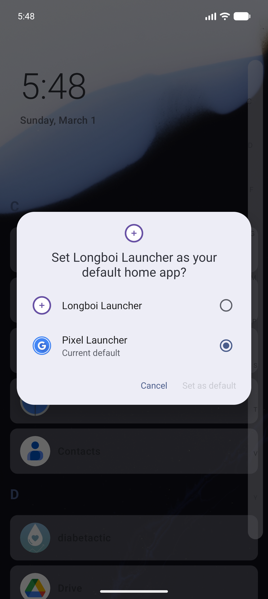

# Longboi Launcher: Niagara Overhaul

A premium Niagara-style vertical list launcher for Android, built with Kotlin and Jetpack Compose. Focus on what matters with a clean, unified interface.

## 📸 Screenshots

<p align="center">
  
  
</p>

## ✨ What it does

- **Unified Experience**: Home and All Apps merged into one fluid vertical list.
- **Alphabet Scrubber**: Interactive persistent vertical scrubber for lightning-fast navigation.
- **Smart Gestures**: Pull down from the top to expand the system notification shade.
- **Icon Pack Support**: Full support for third-party icon packs + built-in "Glass" and "Minimalist" sets.
- **Glance Header**: Dynamic clock, date, and upcoming info aligned for readability.
- **Customizable**: Redesigned Settings with visual theme switching.
- **Modern Tech**: Built with Compose, Hilt, and Flow following MVI architecture.

## 🚀 Getting Started

1. **Build the APK**: `make assemble`
2. **Install**: The APK is at `app/build/outputs/apk/debug/app-debug.apk`
3. **Set as Default**: Follow the system prompts to make Longboi your default home app.

## 🛠️ Project Structure

```text
app/              → Entry point, Hilt root, MainActivity
benchmark/        → Macrobenchmarks and baseline profiles

core/             → Reusable, UI-agnostic functionality
  model/          → Data classes (AppEntry, ProfileType, etc.)
  common/         → Utilities, gestures, role manager
  datastore-proto/→ Proto definitions for type-safe settings
  datastore/      → Proto DataStore repositories
  appcatalog/     → LauncherApps API wrapper
  settings/       → Preferences logic, haptics
  designsystem/   → Theme, components, animations
  icons/          → Icon loading, icon pack support

feature/          → User-facing features (UI modules)
  home/           → Home screen, favorites, pop-ups
  allapps/        → Alphabetical app list with wave scrubber
  searchui/       → Search, calculator, web search, contacts
  settingsui/     → Settings UI, preferences, hidden apps
  privatespace/   → Private space lock/unlock (Android 15+)
  backup/         → Import/export settings
```

## Stack

- **Language**: Kotlin 2.3.0 (with integrated Compose Compiler)
- **UI**: Jetpack Compose (BOM 2026.01.00), Material 3
- **DI**: Hilt 2.58
- **Persistence**: Proto DataStore 1.2.0
- **Images**: Coil 2.5.0
- **Async**: Coroutines + Flow
- **Build**: AGP 8.13.2, Gradle 8.13, Version Catalog
- **Testing**: JUnit 4, MockK, Turbine, Robolectric, Truth
- **Quality**: Spotless, Kover (coverage), Android Lint

## Build & run

```bash
./gradlew assembleDebug          # build
./gradlew testDebugUnitTest      # unit tests
./gradlew spotlessCheck          # check formatting
./gradlew spotlessApply          # fix formatting
./gradlew koverHtmlReport        # coverage report
```

Open in Android Studio Ladybug or later. Build, run, set as default launcher when prompted.

## Quality

- **Formatting**: Spotless + ktlint (automatically enforced)
- **Static analysis**: Android Lint
- **Testing**: JUnit 4, MockK, Turbine, Robolectric, Compose UI tests
- **Coverage**: Kover (HTML and XML reports)
- **Benchmarks**: Macrobenchmark for startup and scroll performance

Use the `Makefile` for convenient shortcuts:
```bash
make test          # Run all tests
make test-unit     # Unit tests only
make coverage      # Generate coverage report
make format        # Format code with Spotless
make lint          # Run Android lint
make assemble      # Build debug APK
```

## Permissions

Longboi needs a few permissions to work as a launcher. None of them are used to collect or send your data anywhere.

- **`QUERY_ALL_PACKAGES`** — Lets the app see what's installed on your phone so it can show your app list. Without this, the launcher would have nothing to display.
- **`BIND_NOTIFICATION_LISTENER_SERVICE`** — Used to show notification badges/counts on apps. You can deny this and the launcher will work fine, just without badges.
- **`BIND_APPWIDGET`** — Needed to host home screen widgets. Standard for any launcher.

## License

Apache 2.0
